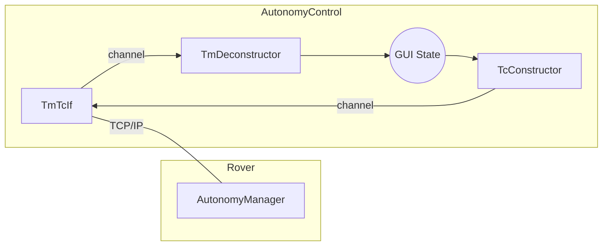

# Autonomy Control GUI

Please note this is an experiment in `rust` to see if it's suitable for GUI development right now - it is not supposed to be used in production.

## Architecture

```mermaid
graph LR

    subgraph Rover
        rov[AutonomyManager]
    end

    subgraph AutonomyControl
        tmtcif[TmTcIf] -- TCP/IP --- rov
        tmtcif -- channel --> tmdes[TmDeconstructor]
        tccon[TcConstructor] -- channel --> tmtcif
        tmdes --> gui((GUI State)) --> tccon
    end


```